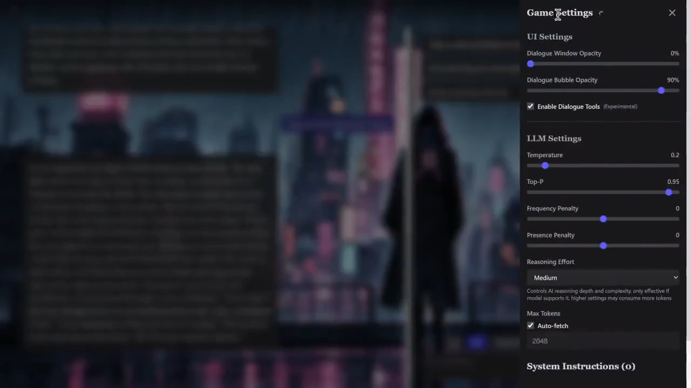
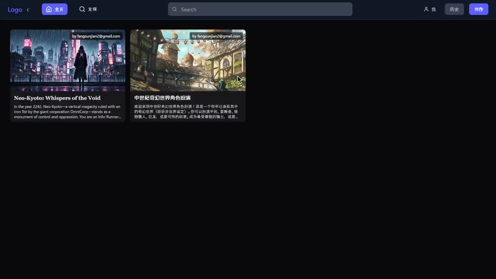
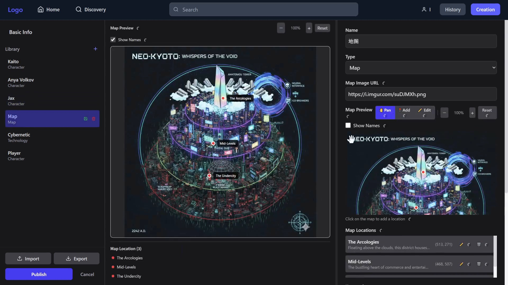
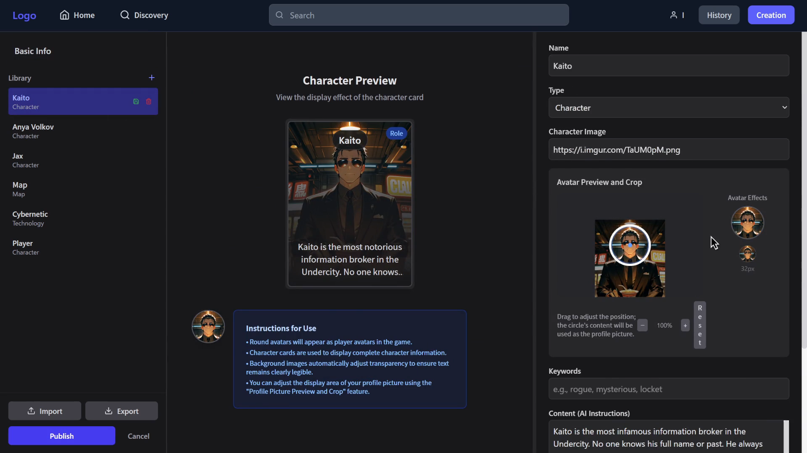

# Agent Adventure

[](./LICENSE)
[](./CONTRIBUTING.md)

[English](./README.md) | 简体中文 | [日本語](./README_ja.md) | [한국어](./README_ko.md)

Agent Adventure 是一个由 AI 驱动的动态文字冒险游戏社区平台。该应用使用 Google Gemini 生成叙述内容和 Imagen 生成插图，为用户创造独特且沉浸式的故事体验。

## 🎬 界面演示

### 游戏体验


### 演示视频
[演示视频](./docs/media/demo_video.mp4)

### 商店


### 角色与场景编辑



## ✨ 核心功能

**🎮 动态故事生成**
- AI 根据玩家选择实时生成丰富的故事内容
- 支持多轮对话和复杂剧情分支
- 智能的故事总结和里程碑记录系统

**🎨 AI 生成视觉内容**
- 每个场景可配备精美的 AI 生成图片
- 动态背景和封面图片支持
- 优雅的图片加载和错误处理

**👥 社区平台**
- 用户注册、登录、个人资料管理
- 故事创作、编辑、发布和分享
- 资料库系统（角色、地点、道具、任务）

**⚙️ 高度自定义**
- 灵活的 AI 后端配置（支持 Gemini 及兼容 OpenAI 的 API）
- UI 主题、缩放、透明度个性化设置
- 中英双语界面支持

## 🛠 技术架构

- **Frontend**: React 19 + TypeScript + Vite
- **Styling**: Tailwind CSS + shadcn/ui + Radix UI
- **State Management**: TanStack Query (React Query) + Zustand
- **Backend/DB**: Supabase (PostgreSQL + Auth + RLS)
- **AI SDK**: Vercel AI SDK

## 🚀 快速开始

### 前置条件
- Node.js 18+
- npm 或 yarn
- 已经注册配置好的 Supabase 账户和项目

### 安装运行

1. **克隆仓库**
   ```bash
   git clone https://github.com/yourusername/agent-adventure.git
   cd agent-adventure
   ```

2. **安装依赖**
   ```bash
   npm install
   ```

3. **环境配置**
   复制示例环境文件并填入你的 Supabase 凭据：
   ```bash
   cp .env.example .env.local
   ```
   编辑 `.env.local` 文件，填入你的 `VITE_SUPABASE_URL` 和 `VITE_SUPABASE_ANON_KEY`。

4. **启动开发服务器**
   ```bash
   npm run dev
   ```

### 数据库设置

项目依赖于 Supabase 的特定表结构：
- `profiles` - 用户资料表
- `stories` - 故事内容表  
- `playthroughs` - 游戏进度表

请参考 `supabase/migrations/` 目录中的 SQL 脚本在你的 Supabase 项目中创建对应的表和安全策略 (RLS)。

## 🤝 参与贡献

我们非常欢迎社区的贡献！请阅读我们的 [贡献指南](./CONTRIBUTING.md) 了解如何提交 Issue 和 Pull Request。

## 📄 开源协议

本项目基于 [MIT 协议](./LICENSE) 开源。

---

**Agent Adventure** - 让每个人都能成为故事的创作者和冒险家 🚀
